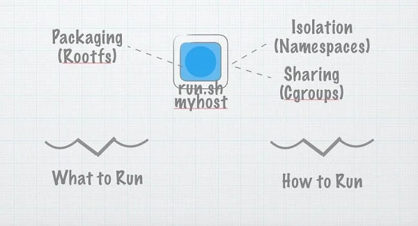

# Build Your Own Container Using Less than 100 Lines of Go

_The release of Docker in 2013 revolutionized how developers package and deploy
applications, ushering in a wave of container technologies that have since
dominated modern software development. While Docker catalyzed significant
innovation, it also spurred confusion, misconceptions, and hype about what
containers are and how they work._

_This guide explores the core technology powering containers, explains how they
are constructed, and demonstrates how to build a simple container runtime in Go.
Along the way, we’ll dive into key concepts like Linux namespaces, cgroups, and
layered filesystems while dissecting the myth of software containers as "just
like" shipping containers._

---

## The Limits of the Shipping Container Analogy

Containers in shipping and software share some similarities: standardization,
modularity, and portability. Shipping containers transformed global trade by
creating a uniform, reusable packaging system that streamlines logistics.
Software containers promise analogous benefits for application development,
enabling scalable and efficient deployments.

However, this analogy oversimplifies software containers, ignoring the technical
details underpinning them. To truly understand containers, it’s necessary to go
beyond this surface-level comparison and look at the technical components that
make them function.

---

## Unpacking the Technology Behind Containers

A software container is a lightweight, portable unit that encapsulates an
application and its dependencies. It achieves isolation from the host system
using Linux kernel features such as:

1. Namespaces: Provide isolation of system resources (e.g., process IDs, network
   interfaces) for each container.
2. Control Groups (cgroups): Limit and allocate CPU, memory, and I/O resources
   for containers.
3. Union File Systems: Enable layered filesystems, allowing containers to share
   a common base image while adding their own unique layers.

These components together enable containers to simulate the behavior of a fully
isolated environment without the overhead of virtual machines.

---

## What is a Container, really?

I’d like to play a game. In your head, right now, tell me what a “container” is.
Done? Ok. Let me see if I can guess what you might’ve said:

You might have said one or more of:

1. A way to share resources
2. Process Isolation
3. Kind of like lightweight virtualisation
4. Packaging a root filesystem and metadata together
5. Kind of like a chroot jail
6. Something something shipping container something
7. Whatever docker does

That is quite a lot of things for one word to mean! The word “container” has
started to be used for a lot of (sometimes overlapping) concepts. It is used for
the analogy of containerisation, and for the technologies used to implement it.
If we consider these separately, we get a clearer picture. So, let’s talk about
the why of containers, and then the how. (Then we’ll come back to why, again).

---

## In the beginning

In the beginning, there was a program. Let's call the program run.sh, and what
we’d do is we’d copy it to a remote server, and we would run it. However,
running arbitrary code on remote computers is insecure and hard to manage and
scale. So we invented virtual private servers and user permissions. And things
were good.

But little run.sh had dependencies. It needed certain libraries to exist on the
host. And it never worked quite the same remotely and locally. (Stop me if
you’ve heard this tune). So we invented AMIs (Amazon Machine Images) and VMDKs
(VMware images) and Vagrantfiles and so on, and things were good.

Well, they were kind-of good. The bundles were big and it was hard to ship them
around effectively because they weren’t very standardised. And so, we invented
caching.

And things were good.

Caching is what makes Docker images so much more effective than vmdks or
vagrantfiles. It lets us ship the deltas over some common base images rather
than moving whole images around. It means we can afford to ship the entire
environment from one place to another. It’s why when you `docker run whatever`
it starts close to immediately even though whatever described the entirety of an
operating system image. We’ll talk in more detail about how this works in
(section N).

And, really, that’s what containers are about. They’re about bundling up
dependencies so we can ship code around in a repeatable, secure way. But that’s
a high level goal, not a definition. So let’s talk about the reality

---

## Building a Container

So (for real this time!) what is a container? It would be nice if creating a
container was as simple as just a create_container system call. It’s not. But
honestly, it’s close.

To talk about containers at the low level, we have to talk about three things.
These things are namespaces, cgroups and layered filesystems. There are other
things, but these three make up the majority of the magic.

### Namespaces

Namespaces provide the isolation needed to run multiple containers on one
machine while giving each what appears like it’s own environment. There are -
at the time of writing - six namespaces. Each can be independently requested and
amounts to giving a process (and its children) a view of a subset of the
resources of the machine.

The namespaces are:

- **PID**: The pid namespace gives a process and its children their own view of
  a subset of the processes in the system. Think of it as a mapping table. When
  a process in a pid namespace asks the kernel for a list of processes, the
  kernel looks in the mapping table. If the process exists in the table the
  mapped ID is used instead of the real ID. If it doesn’t exist in the mapping
  table, the kernel pretends it doesn’t exist at all. The pid namespace makes
  the first process created within it pid 1 (by mapping whatever its host ID is
  to 1), giving the appearance of an isolated process tree in the container.

- **MNT**: In a way, this one is the most important. The mount namespace gives
  the process’s contained within it their own mount table. This means they can
  mount and unmount directories without affecting other namespaces (including
  the host namespace). More importantly, in combination with the pivot_root
  syscall - as we’ll see - it allows a process to have its own filesystem. This
  is how we can have a process think it’s running on ubuntu, or busybox, or
  alpine — by swapping out the filesystem the container sees.

- **NET**: The network namespace gives the processes that use it their own
  network stack. In general only the main network namespace (the one that the
  processes that start when you start your computer use) will actually have any
  real physical network cards attached. But we can create virtual ethernet
  pairs — linked ethernet cards where one end can be placed in one network
  namespace and one in another creating a virtual link between the network
  namespaces. Kind of like having multiple ip stacks talking to each other on
  one host. With a bit of routing magic this allows each container to talk to
  the real world while isolating each to its own network stack.

- **UTS**: The UTS namespace gives its processes their own view of the system’s
  hostname and domain name. After entering a UTS namespace, setting the hostname
  or the domain name will not affect other processes.

- **IPC**: The IPC Namespace isolates various inter-process communication
  mechanisms such as message queues. See the
  [Namespace](https://man7.org/linux/man-pages/man7/namespaces.7.html)
  docs for more details.

- **USER**: The user namespace was the most recently added, and is the likely
  the most powerful from a security perspective. The user namespace maps the
  uids a process sees to a different set of uids (and gids) on the host. This is
  extremely useful. Using a user namespace we can map the container's root user
  ID (i.e. 0) to an arbitrary (and unprivileged) uid on the host. This means we
  can let a container think it has root access - we can even actually give it
  root-like permissions on container-specific resources - without actually
  giving it any privileges in the root namespace. The container is free to run
  processes as uid 0 - which normally would be synonymous with having root
  permissions - but the kernel is actually mapping that uid under the covers
  to an unprivileged real uid. Most container systems don't map any uid in the
  container to uid 0 in the calling namespace: in other words there simply isn't
  a uid in the container that has real root permissions.

Most container technologies place a user’s process into all of the above
namespaces and initialise the namespaces to provide a standard environments.
This amounts to, for example, creating an initial internet card in the isolated
network namespace of the container with connectivity to a real network on the
host.

### CGroups

Cgroups could honestly be a whole article of their own (and I reserve the right
to write one!). I'm going to address them fairly briefly here because there's
not a lot you can't find directly in the documentation once you understand the
concepts.

Fundamentally cgroups collect a set of process or task ids together and apply
limits to them. Where namespaces isolate a process, cgroups enforce fair (or
unfair - it's up to you, go crazy) resource sharing between processes.

Cgroups are exposed by the kernel as a special file system you can mount. You
add a process or thread to a cgroup by simply adding process ids to a tasks file
, and then read and configure various values by essentially editing files in
that directory.

### Layered Filesystems

Namespaces and CGroups are the isolation and resource sharing sides of
containerisation. They’re the big metal sides and the security guard at the
dock. Layered Filesystems are how we can efficiently move whole machine images
around: they're why the ship floats instead of sinks.

At a basic level, layered filesystems amount to optimising the call to create a
copy of the root filesystem for each container.

---

## Must Read:

[The 7 most used Linux namespaces](https://www.redhat.com/en/blog/7-linux-namespaces)
